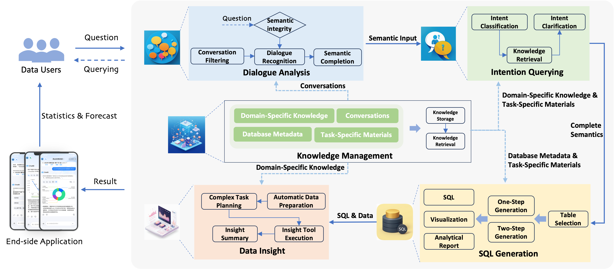

# SiriusBI - A Comprehensive LLM-powered Solution for Data Analytics in Business Intelligence

> ​**Note**: This repository serves as the technical companion for our VLDB 2025 paper. Code implementation will be released pending corporate approval. 

[中文文档](README_CN.md) | [Paper (Preview)](https://arxiv.org/abs/2411.06102) | 

## 🚀 Key Innovations
- ​**Practical ChatBI System**  
  A unified system integrating four core functionalities — knowledge management, multi-round dialogue with querying, SQL generation, and data insight.
- ​**New Dialogue Analysis Mechanism**  
  MRD-Q consists of semantic completion, knowledge-guided clarification, and proactive querying processes to effectively address issues raised by ambiguous or incomplete queries in real-world scenarios.
- ​**Economic Domain Adaptation Strategy**  
  A dynamic strategy selection mechanism for SQL generation conditioned on data characteristics.

## 📊 Benchmark Results
### Performance on Industrial Benchmarks
| Dataset       | EX          |   
|---------------|-------------|
| BIRD          | 68.97%      | 
| MRD-BIRD      | 51.14%      | 

## 📂 Dataset Access
### Publicly Available Benchmarks
1. ​**SRD-Industry/MRD-Industry**  
   Cannot be disclosed due to data privacy reasons.

2. ​**MRD-BIRD**  
   Available under the directory `MRD-BIRD` in this repo.

## 🔧 System Architecture

